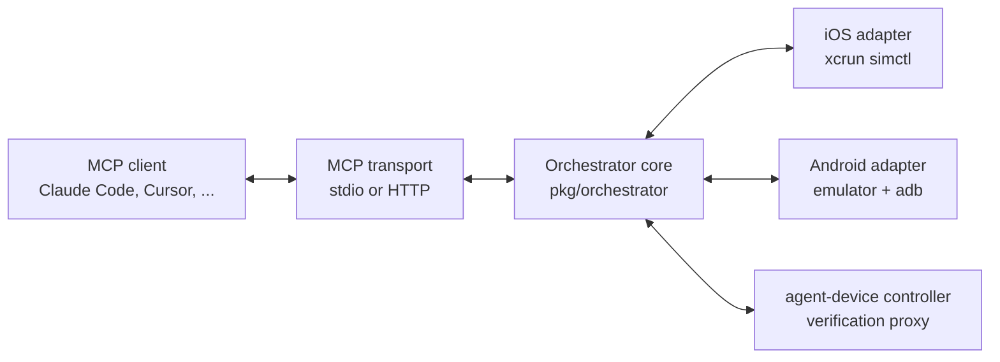

# Architecture

mcp-sim has three layers: an MCP transport, a Go orchestrator core, and simulator adapters.



## Layers

1. **MCP transport** (`pkg/mcp`): exposes the orchestrator as MCP tools (`list_devices`, `boot_device`, `stop_device`, `wipe_device`, `get_state`, `await_ready`, `open_url`, plus controller tools) over stdio or HTTP.
2. **Orchestrator core** (`pkg/orchestrator`): the public Go API. Owns device lifecycle, idempotent actions, and wipe convergence. No transport knowledge.
3. **Adapters** (`platforms/ios`, `platforms/android`, `controllers/agentdevice`): wrap the platform CLIs. Each registers itself only if its tooling is detected, so the same binary works with iOS only, Android only, or both.

## Embedding the orchestrator

The core is a plain Go library. Use it directly from any Go program:

```go
import (
    "log/slog"

    "github.com/espetro/mcp-sim/pkg/orchestrator"
    "github.com/espetro/mcp-sim/platforms/ios"
)

o, err := orchestrator.New(
    orchestrator.WithPlatform(ios.New(ios.Defaults())),
    orchestrator.WithLogger(slog.Default()),
)
if err != nil {
    log.Fatal(err)
}

devices, err := o.List(ctx)
// boot a device and confirm it reached the running state
if err := o.Boot(ctx, deviceID); err != nil { ... }
state, err := o.State(ctx, deviceID)
```

Lifecycle methods (`Boot`, `Stop`, `Wipe`, `State`, `List`, `AwaitReady`, `OpenURL`) are idempotent: calling them twice converges to the same result. `Wipe` returns the device to its configured baseline, including re-applying simslim when `slim.on_boot` is set.

## Extension

See [adding-platform.md](adding-platform.md) for implementing a new platform adapter.

For contributors: the full design rationale and decision record lives in `.agents/docs/ARCHITECTURE.md` in the repo.
